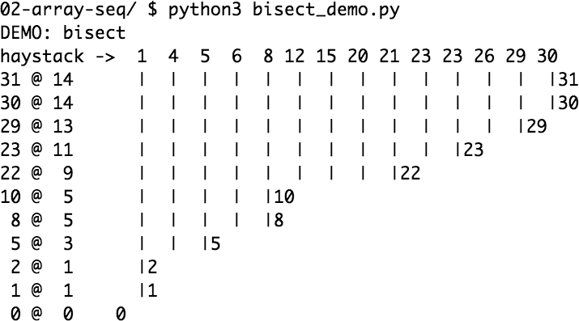

# 1. 정렬된 시퀀스를 `bisect`로 관리하기

`bisect` 모듈은 `bisect()`와 `insort()` 함수를 제공한다. bisect()는 이진 검색 알고리즘을 이용해 시퀀스를 검색하고, `insort()`는 정렬된 시퀀스 안에 항목을 삽입한다.

내용:

[1.1 `bisect()`로 검색하기](article1.md#11-bisect로-검색하기)

[1.2.`insort()`로 삽입하기](article1.md#12-insort로-삽입하기)

## 1.1 `bisect()`로 검색하기
`bisect(haystack, needle)`은 정렬된 시퀀스인 `haystack` 안에서 오름차순 정렬 상태를 유지한 채로 `needle`을 추가할 수 있는 위치를 찾아낸다. 즉, 해당 위치 앞에는 `needle`보다 같거나 작은 항목이 온다. `bisect(haystack, needle)`의 결과값을 인덱스(`index`)로 사용해 `haystack.insert(index, needle)`을 호출하면 `needle`을 추가할 수 있지만, `insort()` 함수는 이 두 작업을 한꺼번에 더 빨리 처리한다.

>**TIP** 파이썬에 상당한 기여를 하고 있는 레이몬드 헤팅거<sup>Raymond Hettinger</sup>는 `bisect` 모듈을 사용하지만 이런 함수 들을 따로 사용하는 것보다 훨씬 쉽게 정렬할 수 있는 `SortedCollection` 비법(<http://bit.ly/1Vm6WEa>)을 제공하고 있다.

[예제 1]은 신중히 선택한 `needles` 시퀀스에 대해 `bisect`가 반환한 삽입 위치를 보여준다. 실행 결과는 [그림 1]과 같다.

_예제 1. 정렬된 시퀀스에서 항목을 추가할 위치를 찾아내는 `bisect`_
```python
import bisect
import sys

HAYSTACK = [1, 4, 5, 6, 8, 12, 15, 20, 21, 23, 23, 26, 29, 30]
NEEDLES = [0, 1, 2, 5, 8, 10, 22, 23, 29, 30, 31]

ROW_FMT = '{0:2d} @ {1:2d} {2}{0:\<2d}'

def demo(bisect_fn):
    for needle in reversed(NEEDLES):
        position = bisect_fn(HAYSTACK, needle) # (1)
        offset = position * ' |'  # (2)
    print(ROW_FMT.format(needle, position, offset))  # (3)

if __name__ == '__main__':

    if sys.argv[-1] == 'left':  # (4)
        bisect_fn = bisect.bisect_left
    else:
        bisect_fn = bisect.bisect

    print('DEMO:', bisect_fn.__name__)  # (5)
    print('haystack ->', ' '.join(f'{n:2}' for n in HAYSTACK))
    demo(bisect_fn)
```
1. 삽입 위치를 찾아내기 위해 선택한 `bisect` 함수를 사용한다.
2. 간격(`offset`)에 비례해 수직 막대 패턴을 만든다.
3. `needle`과 삽입 위치를 보여주는 포맷된 행을 출력한다.
4. 마지막 명령행 인수에 따라 사용할 `bisect` 함수를 선택한다.
5. 선택된 함수명을 헤더에 출력한다.


_그림 1. `bisect`를 이용해 [예제 1]을 실행한 결과. 각 행은 `needle @ position` 형태로 시작하며 `needle`을 삽입할 `haystack` 위치에 `needle` 값을 한 번 더 보여준다._


`bisect`의 작동은 두 가지 방식으로 조절할 수 있다.

첫째, 선택 인수인 `lo`와 `hi`를 사용하면 삽입할 때 검색할 시퀀스 영역을 좁힐 수 있다. `lo`의 기본값은 0, `hi`의 기본값은 시퀀스의 `len()`이다.

둘째, `bisect`는 실제로는 `bisect_right()` 함수의 별칭이며, 이 함수의 자매 함수로는 `bisect_left()`가 있다. 이 두 함수는 단지 리스트 안의 항목이 `needle`과 값이 같을 때만 차이가 난다. `bisect_right()`는 기존 항목 바로 뒤를 삽입 위치로 반환하며, `bisect_left()`는 기존 항목 위치를 삽입 위치로 반환하므로 기존 항목 바로 앞에 삽입된다. int와 같은 단순한 자료형의 경우에는 차이가 없지만, 객체를 담고 있는 시퀀스 안에서는 동일하다고 판단되지만 서로 다른 객 체가 들어 있으므로 이 두 함수 간에 약간의 차이가 있다. 예를 들어 1과 1.0은 다르지만 `1 == 1.0`은 참이다. [예제 1]에 `bisect_left()` 함수를 적용한 결과는 [그림 2]와 같다.

_그림 2. `bisect_left()`를 사용해 [예제 1]을 실행한 결과. [그림 1]과 비교해보면 1, 8, 23, 29, 30을 `haystack` 안의 동일 숫자 왼쪽에 삽입하는 것을 알 수 있다._


`bisect`를 사용하면 수치형 값으로 테이블을 참조할 수 있으므로 [예제 3]에서 보는 것처럼 시험 점수를 등급 문자로 변환할 수도 있다.

_예제 2. 시험 점수를 입력받아 등급 문자를 반환하는 `grade()` 함수_
```python
>>> breakpoints = [60, 70, 80, 90]
>>> grades='FDCBA'
>>> def grade(score):
...     i = bisect.bisect(breakpoints, score)
...     return grades[i]
...
>>> [grade(score) for score in [55, 60, 65, 70, 75, 80, 85, 90, 95]]
['F', 'D', 'D', 'C', 'C', 'B', 'B', 'A', 'A']
```

[예제 2]의 코드는 `bisect` 모듈 문서(<https://docs.python.org/3/library/bisect.html>)에서 가져왔다. 이 문서에는 정렬된 긴 숫자 시퀀스를 검색할 때 `index()` 대신 더 빠른 `bisect()` 함수를 사용하는 여러 함수를 보여준다.

테이블 검색에 사용될 때 `bisect_left()`는 아주 다른 결과를 만든다.[^1] [예제 3]에 나온 등급 문자를 확인하라.

_예제 3. [예제 2]와 달리 `bisect_left()`는 60점을 `'D'`가 아닌 `'F'`에 매핑한다_
```python
>>> breakpoints = [60, 70, 80, 90]
>>> grades='FDCBA'
>>> def grade(score):
...     i = bisect.bisect_left(breakpoints, score)
...     return grades[i]
...
>>> [grade(score) for score in [55, 60, 65, 70, 75, 80, 85, 90, 95]]
['F', 'F', 'D', 'D', 'C', 'C', 'B', 'B', 'A']
```

다음 절에서 설명하는 것처럼 이 함수들은 검색뿐만 아니라 정렬된 시퀀스 안에 항목을 삽입할 때도 사용된다. 다음 절에서 설명한다.

## 1.2 `insort()`로 삽입하기

정렬은 값비싼 연산이므로 시퀀스를 일단 정렬한 후에는 정렬 상태를
유지하는 것이 좋다. 그렇기 때문에 `bisect.insort()` 함수가 만들어졌다.

`insort(seq, item)`은 `seq`를 오름차순으로 유지한 채로 `item`을 `seq`에 삽입한다. [예제 4]와 이 코드를 실행한 결과인 [그림 3]을 보자.

_예제 4. 정렬된 시퀀스를 항상 정렬된 상태로 유지하는 `insort()`_
```python
import bisect
import random

SIZE = 7

random.seed(1729)

my_list = []
for i in range(SIZE):
    new_item = random.randrange(SIZE * 2)
    bisect.insort(my_list, new_item)
    print(f'{new_item:2d} -> {my_list}')
```

_그림 3. [예제 4]를 실행한 결과_


`bisect()` 함수와 마찬가지로 `insort()` 함수도 선택적으로 `lo`와 `hi` 인수를 받아 시퀀스 안에서 검색할 범위를 제한한다. 그리고 삽입 위치를 검색하기 위해 `bisect_left()` 함수를 사용하는 `insort_left()` 함수도 있다.

[^1]: 이 특이성을 알려준 그레고리 셔먼<sup>Gregory Sherman</sup>에게 감사드린다.