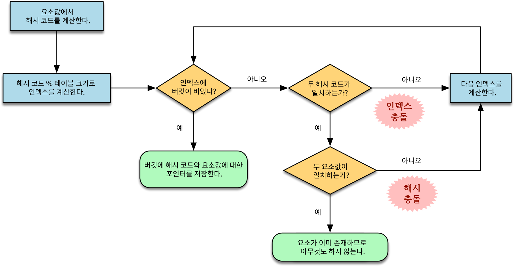
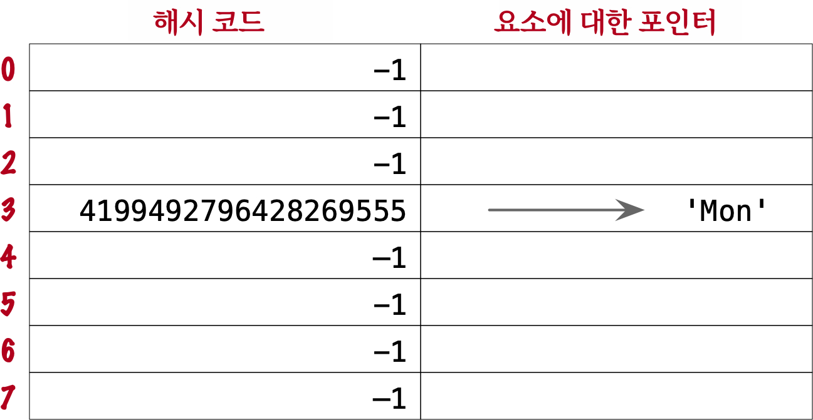
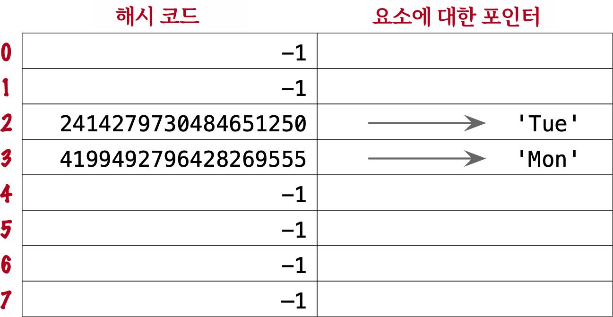
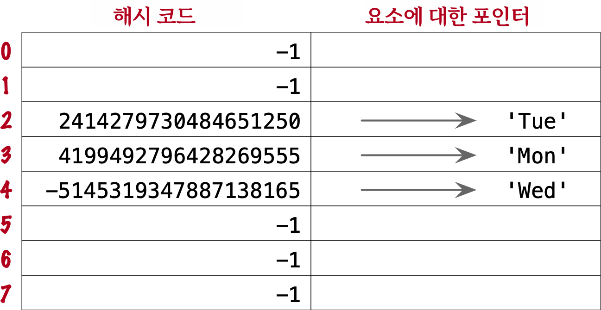
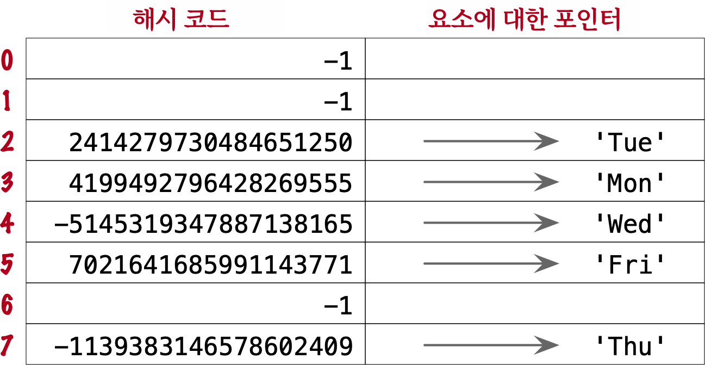
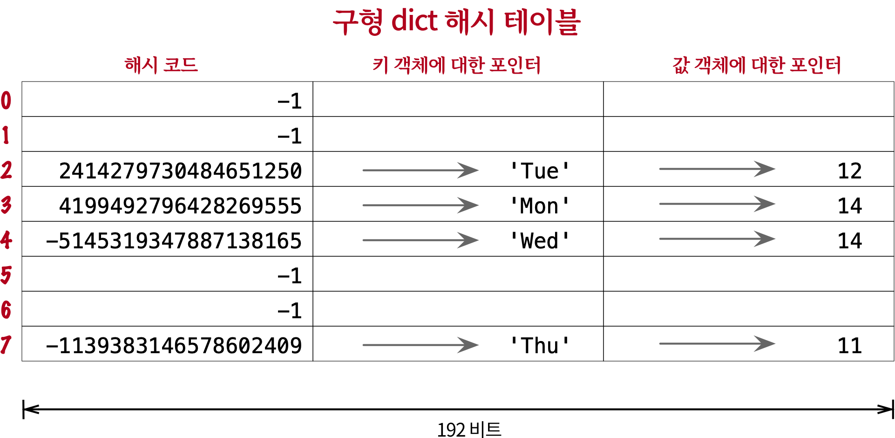
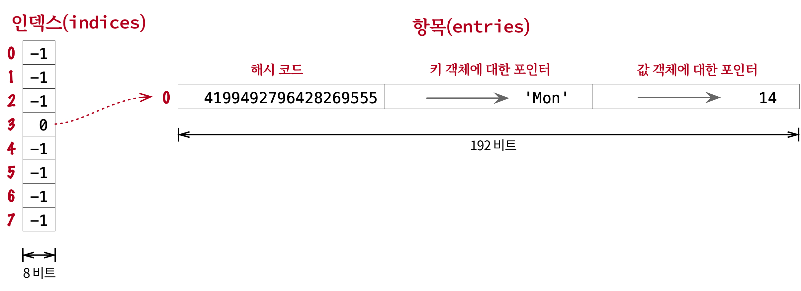
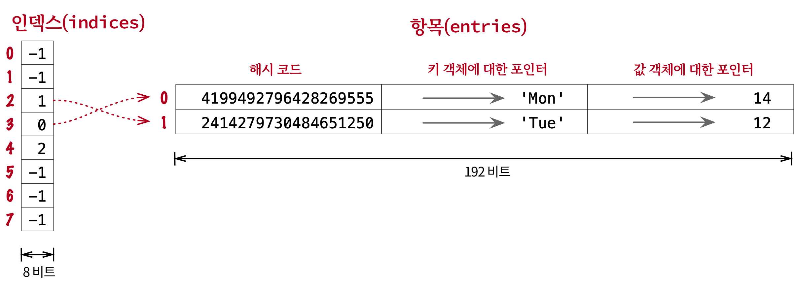
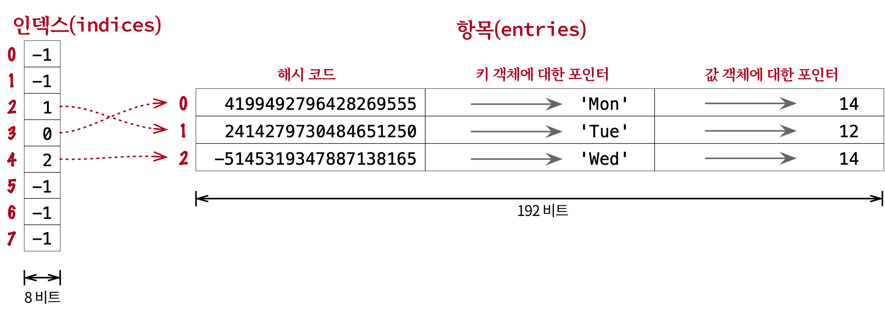
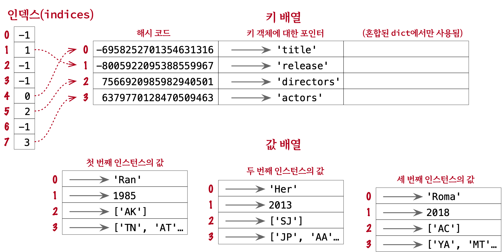

# 2. `set`과 `dict`의 내부구조

파이썬의 `dict`와 `set`은 해시 테이블에 기반해 구현된다. 이 글은 해시 테이블의 사용이 이러한 컨테이너형에 어떠한 장단점을 주는지 설명한다. 이 글은 다음 질문에 대한 답을 제공한다.

- 파이썬 `dict`와 `set`은 얼마나 효율적인가?

- 집합 요소들은 왜 순서가 없을까?

- 파이썬 객체를 왜 `dict`의 키나 `set` 요소로 사용할 수 없을까?

- `dict` 키의 순서가 왜 삽입 순서에 따라 달라질까?

내용:

[2.1 성능 실험](article2.md#21-성능-실험)

[2.2 해시와 동치성](./article2.md#22-해시와-동치성)

* [2.2.1 해시 충돌](./article2.md#221-해시-충돌)

[2.3 숨어 있는 집합 해시 테이블)](./article2.md#23-숨어-있는-집합-해시-테이블)

* [2.3.1 해시 테이블 알고리즘](./article2.md#231-해시-테이블-알고리즘)

* [2.3.2 집합 작동 방식이 미치는 영향](./article2.md#232-집합-작동-방식이-미치는-영향)

[2.4 `dict` 안에서 해시 테이블의 용도](./article2.md#24-dict-안에서-해시-테이블의-용도)

* [2.4.1 소형 `dict`의 공간 절약과 키 삽입 순서 유지](./article2.md#241-소형-dict의-공간-절약과-키-삽입-순서-유지)

* [2.4.2 키-공유 딕셔너리](./article2.md#242-키-공유-딕셔너리)

[2.5 `dict` 작동 방식이 미치는 영향](./article2.md#25-dict-작동-방식이-미치는-영향)

>**NOTE\_** 딕셔너리와 집합을 제대로 사용하기 위해 여기에서 설명하는 세부사항을 모두 알아야 할 필요는 없다. 그러나 구현 개념이 멋지므로 여기에서 소개하는 것이다. 원하면 본문 3.9절 '`dict`의 작동 방식이 미치는 영향'과 3.11절 '집합 작동 방식이 미치는 영향'으로 바로 넘어가도 좋다.

해시 테이블 연구에 대한 흥미를 유발시키기 위해, 먼저 간단한 실험을 통해 수백만 개의 요소를 가진 `dict`와 `set`이 발휘하는 놀라운 성능을 보여주겠다.

## 2.1 성능 실험

경험을 통해 모든 파이썬 개발자는 `dict`와 `set`이 빠르다는 것을 알고 있다. 여기서는 통제된 실험을 통해 이 내용을 확인할 것이다.

`in` 연산자로 검색할 때 `dict`, `set`, `list`의 크기가 성능에 미치는 영향을 확인하기 위해, 중복되지 않는 배밀도 실수 1천만 개로 구성된 배열 `haystack`을 생성하고 나서, `haystack`에 있는 500개의 실수와 `haystack`에 없는 500개의 실수로 구성된 `needles` 배열을 생성했다.

`dict`의 성능을 측정하기 위해 `dict.fromkeys()`를 사용해 1천 개의 실수를 가진  `haystack`이라는 `dict` 객체를 생성했다. 이렇게 데이터를 준비한 후에는 `timeit` 모듈을 이용해 [예제 1] 코드의 실행 시간을 측정했다.

_예제 1. `haystack`에서 `needles`를 검색하고 발견된 개수를 계산_

```python
found = 0
for n in needles:
    if n in haystack:
        found += 1
```

그리고 `haystack`의 크기를 1천만까지 10배씩 증가하면서 네 번 더 성능을 측정했다. `dict`의 성능 측정 결과는 [표 1]과 같다.

_표 1. 파이썬 3.8.0을 실행하는 2.2GHz 코어 i7 랩톱에서 다섯 가지 크기의 `haystack` 딕셔너리에서 1천 개의 `needle`을 검색하기 위해 `in` 연산자를 이용해 측정한 시간_

<table>
<colgroup>
<col style="width: 30%" />
<col style="width: 22%" />
<col style="width: 26%" />
<col style="width: 20%" />
</colgroup>
<thead>
<tr>
<th><blockquote>
<p><strong>haystack의 크기</strong></p>
</blockquote></th>
<th><blockquote>
<p><strong>비율</strong></p>
</blockquote></th>
<th><blockquote>
<p><strong>시간</strong></p>
</blockquote></th>
<th><blockquote>
<p><strong>비율</strong></p>
</blockquote></th>
</tr>
</thead>
<tbody>
<tr>
<td><blockquote>
<p>1,000</p>
</blockquote></td>
<td><blockquote>
<p>1x</p>
</blockquote></td>
<td><blockquote>
<p>0.099ms</p>
</blockquote></td>
<td><blockquote>
<p>1.00x</p>
</blockquote></td>
</tr>
<tr>
<td><blockquote>
<p>10,000</p>
</blockquote></td>
<td><blockquote>
<p>10x</p>
</blockquote></td>
<td><blockquote>
<p>0.109ms</p>
</blockquote></td>
<td><blockquote>
<p>0.10x</p>
</blockquote></td>
</tr>
<tr>
<td><blockquote>
<p>100,000</p>
</blockquote></td>
<td><blockquote>
<p>100x</p>
</blockquote></td>
<td><blockquote>
<p>0.156ms</p>
</blockquote></td>
<td><blockquote>
<p>1.58x</p>
</blockquote></td>
</tr>
<tr>
<td><blockquote>
<p>1,000,000</p>
</blockquote></td>
<td><blockquote>
<p>1,000x</p>
</blockquote></td>
<td><blockquote>
<p>0.372ms</p>
</blockquote></td>
<td><blockquote>
<p>3.76x</p>
</blockquote></td>
</tr>
<tr>
<td><blockquote>
<p>10,000,000</p>
</blockquote></td>
<td><blockquote>
<p>10,000x</p>
</blockquote></td>
<td><blockquote>
<p>0.512ms</p>
</blockquote></td>
<td><blockquote>
<p>5.17x</p>
</blockquote></td>
</tr>
</tbody>
</table>

구체적으로 결과를 보면 필자의 랩톱 컴퓨터에서 1천 개의 실수 키를 1천 개의 요소가 있는 딕셔너리에서 검색하는 데 99 마이크로초, 1천만 개의 요소가 있는 딕셔너리에서 검색하는 데 512 마이크로초 걸렸다. 즉, 1천만 개의 요소를 가진 `haystack`에서 키 하나를 검색할 때 0.512 마이크로초의 시간이 걸린 셈이다. `needle` 하나 검색하는 데 1 마이크로초의 절반 밖에 걸리지 않는다. 검색 공간이 1만배 커졌을 때 검색 시간이 5배 약간 넘게 늘었을 뿐이다. 훌륭하다.

다른 컬렉션과 비교하기 위해 동일한 haystack을 집합과 리스트에 저장해 크기별로 동일한 실험을 수행했다. 집합 테스트의 경우 [예제 1]처럼 `for` 루프의 시간을 측정하는 것 외에, [예제 2]와 같이 한 줄 코드로 시간을 측정했다. [예제 2]의 코드는 `needles`와 `haystack`에 공통으로 존재하는 요소의 개수를 구한다.

_예제 2. `haystack` 안에 있는 `needles` 요소 수를 세기 위해 교집합을 이용_

```python
found = len(needles & haystack)
```

[표 2]는 결과를 나란히 비교한다. 가장 빠른 시간은 ‘`set&` 시간’ 열에 있는데, [예제 2]의 코드를 이용해 교집합(`&`) 연산을 수행한 코드다. 예상대로 ‘`list` 시간’ 열이 가장 느리다. 리스트에는 `in` 연산자 검색을 지원하는 해시 테이블이 없어서 전체 요소를 검색해야 하므로, 거의 `haystack`의 크기에 비례해 시간이 소요된다.

_표 2. 파이썬 3.8.0을 실행하는 2.2GHz 코어 i7 랩톱에서 다섯 가지 크기의 `haystack`을 저장한 `dict`, `set`, `list`에서 `in` 연산자를 이용해 1천 개의 키를 검색하는 데 걸린 전체 시간(`set&`는 [예제 2]의 코드를, 나머지는 [예제 1]의 코드로 시간을 측정했다)._

| **`haystack`의 크기** | **비율** |  **`dict` 시간** | **비율** | **`set` 시간** | **비율** | **`set&` 시간** | **비율** | **`list` 시간** | **비율** |
|----|----|----|----|----|----|----|----|----|----|
| 1,000 | 1x | 0.099ms | 1.00x | 0.107ms | 1.00x | 0.083ms | 1.00x | 9.115ms | 1.00x |
| 10,000 | 10x |  0.109ms | 1.10x | 0.119ms | 1.11x | 0.094ms | 1.13x | 78.219ms | 8.58x |
| 100,000 | 100x | 0.156ms | 1.58x | 0.147ms | 1.37x | 0.122ms | 1.47x | 767.975ms | 84.25x |
| 1,000,000 | 1,000x | 0.372ms | 3.76x | 0.246ms | 2.47x | 0.240ms | 2.89x | 8,020.312ms | 879.90x |
| 10,000,000 | 10,000x | 0.512ms | 5.17x | 0.330ms | 3.08x | 0.298ms | 3.59x | 78,558.771ms | 8,618.63x |

프로그램에서 외부 장치로의 입출력을 수행한다면 `dict`나 `set`의 크기에 상관없이 키 검색 시간은 무시할 수 있을 정도로 작다.

`dict`와 `set`에 대한 속도를 실제로 검증해봤으니, 이제 어떻게 이런 속도가 나오는지 알아보자.

해시 테이블의 내부를 알아보기 전에 먼저 해시 코드 및 해시 코드가 어떻게 동치성과 연관되어 있는지 알아보자.

## 2.2 해시와 동치성

`hash()` 내장 함수는 내장 자료형은 직접 처리하고 사용자 정의 자료형의 경우 `__hash__()` 메서드를 호출한다. 두 객체가 동일하면 이 값들의 해시값도 동일해야 한다. 그렇지 않으면 해시 테이블 알고리즘이 제대로 작동하지 않는다. 예를 들어 정수와 실수의 내부 표현 형태는 다르지만, `1 == 1.0`이 참이므로 `hash(1) == hash(1.0)`도 참이 되어야 한다.[^1]

그리고 해시 테이블 인덱스로서의 효율성을 높이려면 해시값이 가능한 한 인덱스 공간에 골고루 퍼져야 한다. 즉, 이상적으로는 비슷하지만 똑같지 않은 객체들의 해시값은 상당히 달라야 한다. [예제 3]은 해시값의 비트 패턴을 비교한 것이다. 1과 1.0의 해시값은 똑같지만, 1.0001, 1.0002, 1.0003의 해시값은 서로 상당히 다르다.

예제 3. 파이썬 32비트 버전에서 1, 1.0001, 1.0002, 1.0003의 해시 패턴 비교. 위와 아래에 있는 해시값의 비트가 다른 경우 `!` 기호로 표시했다. `!=` 기호 뒤의 숫자는 이전 숫자와 다른 비트의 개수를 나타낸다

```
32-bit Python build
1        00000000000000000000000000000001
                                          != 0
1.0      00000000000000000000000000000001
------------------------------------------------
1.0      00000000000000000000000000000001
           ! !!! ! !! ! !    ! ! !! !!!   != 16
1.0001   00101110101101010000101011011101
------------------------------------------------
1.0001   00101110101101010000101011011101
          !!!  !!!! !!!!!   !!!!! !!  !   != 20
1.0002   01011101011010100001010110111001
------------------------------------------------
1.0002   01011101011010100001010110111001
          ! !   ! !!! ! !  !! ! !  ! !!!! != 17
1.0003   00001100000111110010000010010110
------------------------------------------------
```

>**NOTE\_** 이슈 13703 – '해시 충돌 보안 문제<sup>Hash collision security issue</sup>'에 문서화된 것처럼, 파이썬 3.3부터 `str`, `bytes`, `datetime` 객체의 해시에는 무작위 솔트값<sup>salt value</sup>이 추가되었다. 솔트값은 파이썬 프로세스가 실행되는 동안에는 동일하게 유지되지만, 파이썬 프로세스를 새로 실행하면 달라진다. PEP 456에 따라 파이썬 버전 3.4에서는 `str`과 `bytes` 객체의 해시 코드를 계산하기 위해 `SipHash()` 암호화 함수를 채택했다. 무작위 솔트와 `SipHash()`는 서비스 거부(DoS) 공격을 예방하기 위한 보안 장치다. 자세한 내용은 `__hash__()` 특별 메서드의 문서(<https://docs.python.org/3/reference/datamodel.html#object.__hash__>)에 있는 노트를 참조하라.

### 2.2.1 해시 충돌

앞에서 설명한 대로 해시 크기가 컴퓨터의 워드 크기이므로 64비트 CPython의 해시 코드는 2<sup>64</sup>가지의 값이 가능한데, 이 값은 10<sup>19</sup>보다 크다. 그러나 파이썬 자료형들은 아주 많은 값들을 표현할 수 있다. 예를 들어 출력 가능한 아스키 문자 10개를 무작위로 뽑아 문자열을 만들면 100<sup>10</sup>가지의 값이 가능한데, 이 값은 2<sup>66</sup>보다 크다. 따라서 객체의 해시 코드는 실제 객체가 가진 값보다 적은 정보를 가진다. 결국 서로 다른 객체가 동일한 해시 코드를 갖는 것도 가능해진다.

>**TIP\_** 제대로 구현하면 서로 다른 해시 코드는 다른 객체임을 보장하지만, 그 반대는 성립하지 않는다. 즉, 서로 다른 객체가 언제나 다른 해시 코드를 갖는 것은 아니다. 서로 다른 객체가 똑 같은 해시 코드를 갖는 문제를 해시 충돌이라고 한다.

해시 코드와 객체 동일성에 대해 기본적으로 알아보았으니, 이제부터 해시 테이블이 어떻게 작동하는지, 해시 충돌을 어떻게 처리하는지 알아보자.

## 2.3 숨어 있는 집합 해시 테이블

해시 테이블은 엄청난 발명품이다. 집합에 요소를 추가할 때 해시 테이블을 어떻게 사용하는지 알아보자.

예를 들어 다음과 같이 요일명 약자를 가진 집합이 있다고 하자.

```python
>>> workdays = {'Mon', 'Tue', 'Wed', 'Thu', 'Fri'}
>>> workdays
{'Tue', 'Mon', 'Wed', 'Fri', 'Thu'}
```

파이썬 집합의 핵심 데이터 구조체는 행이 최소 8개 있는 해시 테이블이다. 전통적으로 해시 테이블 안의 행은 버킷<sup>bucket</sup>이라고 부른다.[^2]

요일(`workdays`) 요소를 담은 해시 테이블은 [그림 1]과 같은 모양을 가진다.

_그림 1. 집합 `{'Mon', 'Tue', 'Wed', 'Thu', 'Fri'}`를 담은 해시 테이블. 각 버킷은 해시 코드, 요소값에 대한 포인터, 총 두 개의 필드로 구성된다. 빈 버킷은 해시 코드 필드 값이 -1이고, 순서는 뒤죽박죽이다._


### 2.3.1 해시 테이블 알고리즘

먼저 `set`의 내부 구조를 알아보고 나서 이 개념을 `dict`에 적용하겠다.

>**NOTE\_** 여기서는 `set`을 구현하기 위해 파이썬이 해시 테이블을 사용하는 방법을 개념적으로 단순화시켜 설명한다. 자세한 내용은 Include/setobject.h(<https://github.com/python/cpython/blob/main/Include/setobject.h>)와 Objects/setobject.c(<https://github.com/python/cpython/blob/main/Objects/setobject.c>)에 있는 CPython의 `set`과 `frozenset`에 대한 주석이 달린 소스코드를 참조하라.

이제 파이썬이 `{'Mon', 'Tue', 'Wed', 'Thu', 'Fri'}`과 같은 집합을 어떻게 만드는지 단계별로 살펴보자. 알고리즘은 [그림 2]와 같은데, 다음 소절에서 설명한다.

_그림 2. 집합의 해시 테이블에 요소를 추가하는 알고리즘 플로챠트_



#### 0단계: 해시 테이블 초기화

앞에서 설명한 것처럼 집합의 해시 테이블은 8개의 빈 버킷으로 시작한다. 요소를 추가할 때 파이썬은 버킷들의 적어도 1/3 이상이 비어있도록 보장하며, 공간이 더 필요하면 해시 테이블 크기를 두 배로 만든다. 버킷의 해시 코드 필드는 -1로 초기화해 해시 코드가 없음을 나타낸다.[^3]

#### 1단계: 요소에 대한 해시 코드를 계산한다

리터럴 `{'Mon', 'Tue', 'Wed', 'Thu', 'Fri'}`가 주어지면 파이썬은 첫 번째 요소 `'Mon'`에 대한 해시 코드를 계산한다. 예를 들어 `'Mon'`에 대한 실제 해시 코드는 다음과 같다(문자열에 대한 해시 코드를 계산할 때 파이썬이 무작위 솔트를 사용하므로 여러분이 직접 실행할 때는 값이 다를 수 있다).

```python
>>> hash('Mon')
4199492796428269555
```

#### 2단계: 해시 코드에서 유도한 인덱스의 해시 테이블을 조사한다

파이썬이 해시 코드를 테이블 크기로 나눈 나머지를 이용해 해시 테이블 인덱스를 구한다. 여기서 테이블 크기가 8이므로 나머지는 3이다.

```python
>>> 4199492796428269555 % 8
3
```

해시 테이블 조사는 해시 코드에서 인덱스를 계산하고 해시 테이블 안의 해당 버킷을 찾아보는 작업으로 구성된다. 여기서는 파이썬이 인덱스 3에 있는 버킷을 살펴보고 해시 코드 필드가 -1로 되어 있으므로 버킷이 비어 있음을 확인한다.

#### 3단계: 빈 버킷에 항목을 넣는다

파이썬은 새 요소의 해시 코드 4199492796428269555를 오프셋 3의 해시 코드 필드에, 문자열 객체 `'Mon'`을 요소 필드에 저장한다. [그림 3]은 해시 테이블의 현재 상태를 보여준다.

_그림 3. 집합 `{'Mon'}`의 해시 테이블_



#### 나머지 요소들의 추가

두 번째 요소 `'Tue'`에 대해서도 앞의 단계 1, 2, 3이 반복된다. `'Tue'`에 대한 해시 코드는 2414279730484651250이고 인덱스는 2다.

```python
>>> hash('Tue')
2414279730484651250
>>> hash('Tue') % 8
2
```

`'Tue'` 요소에 대한 해시와 포인터는 비어 있던 버킷 2에 저장된다. 이제 상태는 [그림 4]와 같다.

_그림 4. 집합 `{'Mon', 'Tue'}`에 대한 해시 테이블. 해시 테이블에서 요소. 순서가 유지되지 않음에 주의하라._



#### 충돌 처리

`'Wed'`를 집합에 추가할 때 파이썬이 계산한 해시 코드는 -5145319347887138165, 인덱스는 3이다. 파이썬이 버킷 3을 조사하고 나서 이 버킷이 이미 사용되었음을 발견한다. 그러나 여기에 저장된 해시 코드 4199492796428269555는 다른 값이다. 해시와 동치성에서 설명한 것처럼 두 객체의 해시 코드가 다르면 이들의 값도 다르다. 여기서 발생한 문제는 인덱스 충돌이다. 파이썬은 다음 버킷을 조사하고 그 버킷이 비어 있음을 발견한다. [그림 5]에서 보는 것처럼 `'Wed'`는 인덱스 4를 가지게 된다.

_그림 5 집합 `{'Mon', 'Tue', 'Wed'}`에 대한 해시 테이블. 인덱스 충돌 때문에 `'Wed'`는 인덱스 4에 들어간다_



다음 요소 `'Thu'`의 추가는 간단하다. 버킷 충돌이 없으므로 원래 들어가야 할 인덱스 7에 들어간다.

`'Fri'`를 추가하는 것은 약간 더 흥미롭다. 해시 코드가 7021641685991143771이므로 인덱스가 3이 되는데, 이 인덱스는 이미 `'Mon'`이 차지했다. 파이썬은 다음 버킷인 인덱스 4를 조사한 후 그 곳에는 `'Wed'`가 저장되어 있음을 알아낸다. 그 다음 버킷을 조사해보고 그 곳이 비어 있으므로 `'Fri'`는 결국 인덱스 5 버킷에 저장된다. `'Fri'`를 추가한 후의 해시 테이블은 [그림 6]과 같다.

>**NOTE\_** 인덱스가 충돌했을 때 값을 증가시키는 것은 선형 탐색<sup>linear probing</sup>이라고 한다. 이렇게 하다보면 일련의 버킷들이 나란히 차게 되면서 해시 테이블의 성능을 떨어뜨린다. CPython은 선형 탐색 회수를 세고 있다가 일정 임곗값을 넘으면 유사 난수 발생기<sup>pseudo random number generator</sup>를 적용해 해시 코드의 다른 부분에서  인덱스를 가져온다. 집합이 커지면 이러한 최적화가 중요해진다.

_그림 6. 집합 `{'Mon', 'Tue', 'Wed', 'Thu', 'Fri'}`을 가진 해시 테이블. 테이블의 62.5%가 채워져 있으므로 2/3 임곗값에 가깝다._



검색한 버킷 안에 요소가 있고 해시 코드가 일치하면 파이썬은 실제 객쳇값도 비교해야 한다. Siphash 알고리즘 덕분에 문자열에는 이런 일이 잘 일어나지는 않지만, 해시 충돌에서 설명한 것처럼 서로 다른 두 개의 객체가 동일한 해시 코드를 갖는 일이 가능하기 때문이다.[^4] 해시 가능한 객체가 `__hash__()`와 `__eq__()` 메서드 두 개 모두 구현해야 하는 이유가 바로 이 문제 때문이다.

지금의 해시 테이블에 요소를 새로 추가하면 2/3 이상의 버킷이 채워지므로, 인덱스 충돌 가능성이 높아진다. 이 문제를 방지하기 위해 파이썬은 버킷이 16개인 해시 테이블을 새로 할당해 기존 요소들을 다시 채운다.

상당히 많은 작업처럼 들리지만, 집합 안에 요소가 수백만 개 있어도 충돌없이 삽입되는 경우들이 많으며 한 번 삽입할 때 평균 1내지 2회 충돌이 일어난다. 일반적인 경우에는 아주 불행한 요소도 몇 번의 충돌 문제가 해결된 후에는 삽입할 수 있다.

이제 지금 상태에서 컴퓨터를 사용하지 않고 [그림 2]의 플로차트에 따라 다음 문제를 풀어보자.

다음과 같은 집합이 있을 때, 정수 1을 추가하면 어떤 일이 생길까?

```python
>>> s = {1.0, 2.0, 3.0}
>>> s.add(1)
```

집합 `s` 안에 요소가 몇 개가 될까? 요소 1이 요소 1.0을 대체할까? 답을 생각한 후에 파이썬 콘솔을 이용해 검증해보라.

#### 해시 테이블 요소의 검색

[그림 6] 해시 테이블에 들어 있는 요일명 집합을 생각해보자. `'Sat'`이 들어 있나? `'Sat' in workdays` 표현식에 대한 가장 간단한 실행 경로는 다음과 같다.

1. `hash('Sat')`을 호출해 해시 코드를 계산한다. 여기서는 4910012646790914166이라고 하자.

2. `hash_code % table_size`를 이용해 해시 코드에 대한 테이블 인덱스를 구한다. 여기서 인덱스는 6이다.

3. 인덱스 6의 버킷을 탐색하니 비어 있다. 즉 `'Sat'`은 집합에 들어 있지 않다. `False`를 반환한다.

이제 집합에 존재하는 요소에 대한 가장 간단한 경로를 생각해보자. `'Thu' in workdays`를 평가하는 과정은 다음과 같다.

1. `hash('Thu')`를 호출한다. 결과가 -1139383146578602409라고 하자.

2. 인덱스를 계산한다. -1139383146578602409 % 8은 5다.

3.  인덱스 5의 버킷을 탐색한다.

    1. 해시 코드를 비교한다. 값이 같다.

    2. 객체값을 비교한다. 값이 같다. `True`를 반환한다.

충돌은 요소를 추가할 때 설명한 방식대로 처리된다. 사실 [그림 2]의 플로차트는 검색에도 적용된다. 다만 마지막에 나온 모서리가 둥근 사각형이 없을 뿐이다. 빈 버킷이 나오면 요소가 존재하지 않는 것이므로 파이썬이 `False`를 반환할 뿐이다. 그렇지 않고 해시 코드와 검색할 요소의 값이 해시 테이블의 요소와 일치하면 `True`를 반환한다.

### 2.3.2 집합 작동 방식이 미치는 영향

`set`과 `frozenset`은 둘 다 해시 테이블을 이용해 구현되었기 때문에 다음과 같은 영향을 받는다.

- 집합 요소는 해시 가능한 객체이어야 한다. 이 객체들은 3.4.1절 '해시 가능한 객체'에서 설명한 대로 `__hash__()`와 `__eq__()` 메서드를 적절히 구현해야 한다.

- 요소의 존재 여부를 확인하는 과정이 매우 효율적이다. 집합 안에 요소가 수백만 개가 있더라도 요소의 해시 코드를 계산하고 인덱스를 유도해 버킷을 바로 찾을 수 있다. 다만 해시 충돌 때문에 몇 개의 요소를 더 비교하는 오버헤드가 발생할 수는 있다.

- 집합은 메모리 오버헤드가 상당히 크다. 컨테이너의 가장 간단한 내부 구조는 포인터의 배열일 것이다.[^5] 이에 비해 해시 테이블에는 항목마다 해시 코드가 들어 있고, 충돌을 피하기 위해 적어도 버킷의 1/3은 비어 있어야 한다.

- 요소 순서는 삽입한 순서에 따라 달라지는데, 이 순서에 의지할 수 없다. 두 요소의 인덱스가 충돌되면 어느 요소를 먼저 추가했느냐에 따라 버킷 안에 저장된 값이 달라진다.

- 집합 안에 요소를 추가하면 다른 요소들의 순서가 달라질 수 있다. 해시 테이블이 어느 정도 차면 적어도 1/3의 버킷이 비어 있도록 유지하기 위해 파이썬이 해시 테이블을 다시 생성하기 때문이다. 해시 테이블을 다시 생성할 때 요소를 다시 추가하면서 다른 충돌이 발생할 수 있다.

## 2.4 `dict` 안에서 해시 테이블의 용도

> 해시가 고유한 값이기를,
> 키가 충돌하는 일이 없기를,
> 그리고 딕셔너리의 순서는
> 영원히 유지되리라.
>
> 브랜든 로즈<sup>Brandon Rhodes</sup>,
> <훨씬 더 강력한 딕셔너리>[^6] 에서

2012년 이후 메모리 사용량을 줄이기 위해 `dict` 형은 두 가지 방식으로 상당히 최적화되었다. 첫 번째는 PEP 412 – '키-공유 딕셔너리<sup>Key-Sharing Dictionary</sup>'로 제안되어 파이썬 3.3에서 구현되었다[^7]. 두 번째는 '소형 `dict`'라고 불리며 파이썬 3.6에 도입되었다. 소형 `dict`에서 제공하는 공간 최적화 덕분에 키 삽입 순서도 유지되게 되었다. 다음에 나오는 여러 소절에서는 소형 `dict`와 새로운 키-공유 체계를 차례대로 알아본다.

### 2.4.1 소형 `dict`의 공간 절약과 키 삽입 순서 유지

> **NOTE\_** 여기서는 파이썬 `dict`가 구현된 방식을 상위 수준에서 설명한다. 차이점 중 하나는 `dict` 해시 테이블의 실제 가용한 비율이 집합의 2/3가 아니라 1/3이라는 점이다. 1/3이라는 비율은 예제 `dict`에서 4개의 항목을 보관하기 위해 16개의 버킷이 필요하게 만들고 이번 절 설명에 나오는 다이어그램이 너무 조그맣게 되므로 설명에서는 가용 비율이 2/3인 것처럼 설명한다. Objects/dictobject.c에는 실제 비율이 1/3에서 2/3이면 실제로 잘 작동한다는 코멘트가 있다.

`'Mon'`에서 `'Thu'`까지의 요일명 약자와 각 요일에 등록한 수영 수업 학생들의 숫자를 담은 다음과 같은 `dict`가 있다고 하자.

```python
>>> swimmers = {'Mon': 14, 'Tue': 12, 'Wed': 14, 'Thu': 11}
```

소형 `dict`로 최적화하기 전에 수영 수업 학생수를 담은 딕셔너리의 기반이 되는 해시 테이블은 [그림 7]과 같은 모양이다. 그림에서 알 수 있듯이 64비트 파이썬에서 각 버킷에는 세 개의 64비트 필드(키의 해시 코드, 키 객체에 대한 포인터, 값 객체에 대한 포인터)가 들어있다. 즉, 각 버킷의 크기가 24바이트다.

_그림 7. 키-값 쌍이 네 개 있는 dict의 구식 해시 테이블 포맷. 각 버킷은 키의 해시 코드, 키에 대한 포인터, 값에 대한 포인터를 가진 구조체다._



앞의 두 필드는 집합 구현에서와 똑 같은 역할을 한다. 키를 찾기 위해 파이썬이 키의 해시 코드를 구하고, 키에 대한 인덱스를 찾은 후, 해시 테이블을 탐색해서 해시 코드 및 매칭되는 키 객체가 들어 있는 버킷을 찾는다. 세 번째 필드는 dict의 핵심 기능을 제공한다. 즉, 키를 임의의 값에 매핑시킨다. 키는 해시 가능한 각체이어야 하고 해시 테이블 알고리즘은 키가 `dict` 안에서의 고유한 값임을 보장한다. 그러나 값은 어떠한 객체도 될 수 있으므로, 해시 가능하거나 고유한 값일 필요 없다.

레이몬드 해팅거<sup>Raymond Hettinger</sup>는 해시 코드 및 키와 값에 대한 포인터를 배열에 빈틈없이 채우고, 실제 해시 테이블은 항목을 담은 배열에 대한 인덱스를 가진 훨씬 더 작은 버킷을 가진 성긴 배열<sup>sparse array</sup>에 저장하면 메모리 사용량을 아주 많이 줄일 수 있음을 발견했다[^8]. python-dev 메일링 리스트에 보낸 원래 메시지에서는 해시 테이블 인덱스라고 불렀다. 인덱스에 있는 버킷의 너비는 `dict`가 커지면서 달라지지만, -1은 빈 항목, -2는 삭제된 항목을 나타내기 위해 음숫값은 특별한 용도로 예약하고, 버킷마다 8비트를 사용할 때 128개 항목까지 인덱스하기 충분하다.

예를 들어 수영 강습자 딕셔너리 `swimmers'는 [그림 8]과 같이 저장될 것이다.

_그림 8. 4개의 키값 쌍을 가진 소형 `dict`의 저장소. 해시 코드 및 키와 값에 대한 포인터는 항목 배열 안에 삽입 순서대로 저장되고, 해시 코드에서 유도된 배열 항목에 대한 인덱스는 성긴 인덱스 배열에 저장된다. 성긴 배열에서 -1 인덱스 값은 버킷이 비어 있음을 나타낸다._


CPython 64 비트 버전에서 예전 방식대로라면 4개 항목의 수강생 딕셔너리를 저장하기 위해 버킷마다 24바이트, 8개의 행으로 구성해 총 192 바이트의 메모리를 사용했다. 이와 동일한 소형 `dict`에서는 항목에 96 바이트(24 바이트 * 4) 및 (8 비트의 배열로 설정되므로) 인덱스에 버킷을 저장하기 위한 8 바이트, 총 104바이트만 사용한다.

다음 절에서는 이 배열 두 개를 사용하는 방법을 설명한다.

#### 소형 `dict`에 항목 추가하기

**0 단계: 인덱스 준비**

처음에 인덱스 테이블은 8개의 버킷이 있는 부호를 가진 바이트의 배열로 만들어지고, 값이 -1로 초기화되어 ‘빈 버킷’임을 나타낸다. 이런 버킷이 최대 5개까지 항목 배열의 인덱스로 유지되어, 항목들의 1/3이 -1 값을 유지하게 만든다. 오른쪽의 항목 배열은 예전 방식과 똑같이 키-값 데이터를 세 개의 필드에 보관하지만, 삽입된 순서로 저장된다.

**1 단계: 키에 대한 해시 코드 계산**

키-값 쌍 ('Mon', 14)을 `swimmers` 딕셔너리에 추가하기 위해, 파이썬은 먼저 `hash('Mon')`을 호출해 해당 키에 대한 해시 코드를 계산한다.

**2 단계: 인덱스를 통한 항목 탐색**

파이썬이 `hash('Mon') % len(indices)`를 계산한다. 이 예제에서 계산된 값은 3이다. 인덱스 배열의 오프셋 3에 -1 값이 들어 있으므로 버킷이 비어 있음을 의미한다.

**3 단계: 항목에 키-값을 넣고, 인덱스를 갱신한다.**

`entries` 배열이 비어 있으므로 사용할 수 있는 오프셋이 0이다. 파이썬은 `indices` 배열 오프셋 3에 0을 넣고, `entries`의 오프셋 0에 키의 해시 코드, 키 객체 `'Mon'`에 대한 포인터, 정숫값 14에 대한 포인터를 저장한다. [그림 9]는 `swimmers`의 값이 `{'Mon': 14}`일 때 이 두 배열의 상태를 보여준다.

_그림 9. `{'Mon': 14}`에 대한 저장소. `indices[3]`에 첫 번째 항목 `entries[0]의 오프셋이 들어 있다._



**다음 항목 추가 과정**

`('Tue', 12)`를 `swimmers`에 추가할 때 다음과 같은 일이 일어난다.

1. 키 `'Tue'`의 해시 코드를 계산한다.

2. `hash('Tue') % len(indices)`를 계산해 `indices` 안에서의 오프셋을 계산한다. 계산한 결과 값 2가 나온다. `indices[2]`의 값이 -1이므로, 아직 충돌이 일어나지 않았다.

3. 사용 가능한 `entries` 오프셋 1을 `indices[2]`에, 키-값을 `entries[1]`에 저장한다.

현재 상태는 [그림 10]과 같다. `entries`에는 키-값 쌍을 삽입한 순서대로 보관함에 유의하라.

_그림 10. 소형 `dict`에 `{'Mon': 14, 'Tue': 12}`를 저장한 상태_



**충돌 처리 과정**

1. 키 `'Wed'`의 해시 코드를 계산한다.

2. `hash('Wed') % len(indices)`를 계산하면 3이 나오는데, `indices[3]`의 값이 0이므로, 이미 항목이 있음을 알 수 있다. `entries[0]`의 해시 코드는 `'Mon'`의 해시 코드인데, 이 값은 `'Wed'`의 해시 코드와 다르다. 따라서 인덱스 충돌이 발생했음을 나타낸다. 다음 오프셋의 `indices[4]`를 조사하면 값이 -1이므로, 사용할 수 있음을 알 수 있다.

3. `indices[4] = 2`로 만든다. `entries` 배열에서 다음으로 사용할 수 있는 오프셋이 2이기 때문이다. 그러고 나서 `entries[2]`에 데이터를 채운다.

`('Wed', 14)`를 추가한 후의 모습은 [그림 11]과 같다.

_그림 11. `{'Mon': 14, 'Tue': 12, 'Wed': 14}`를 저장한 소형 `dict` 모습_



#### 소형 `dict`가 커지는 방식

`indices` 배열에 있는 버킷들이 처음에는 8 바이트임에 주의하라. 버킷들의 1/3을 비워두기 위해 최대 5개의 항목에 대한 오프셋을 저장할만한 크기다. `dict`에 6번째 항목이 추가될 때 10개의 오프셋을 저장할 수 있도록 16개의 버킷을 `indices`에 다시 할당한다. 129번째 항목이 추가되기 전까지 각 버킷은 부호 있는 하나의 바이트를 사용하며 필요할 때마다 `indices`의 크기를 두 배로 늘린다. 그러나 129번째를 추가할 때 `indices` 배열은 8비트 크기의 버킷 256개를 갖지만, 부호 있는 바이트는 128번째 이후의 항목에 대한 오프셋을 저장할 수 없다. 따라서 부호 있는 정수 256개를 갖도록 `indices` 배열을 다시 만드는데, 그러면 `entries` 배열의 32,768번째의 오프셋까지 표현할 수 있다. 그러고 나서 171번째 항목을 추가할 때 `indices` 배열의 2/3이 채워지므로 배열을 두 배로 재할당해 512개의 항목을 갖도록 재할당하지만, 각 버킷은 그대로 16비트 크기를 사용한다. 간단히 말하면, `indices` 배열은 버킷 수를 두 배로 증가시키면서 커진다. 그리고 자주 발생하지는 않지만, 한 버킷이 `entries`를 표현할 수 없을 정도로 항목이 많아지면 각 버킷의 크기도 두 배로 늘린다.

이로서 소형 `dict` 구현에 대한 간단한 설명을 마친다. 세세하게 더 설명할 것도 있지만 생략하고, 이제 딕셔너리의 공간 절약을 최적화하는 또 다른 기법인 키-공유<sup>key-sharing</sup> 딕셔너리를 알아보자.

### 2.4.2 키-공유 딕셔너리

클래스에 `__slots__` 속성이 없다면, 사용자 정의 클래스의 인스턴스는 속성을 평범한 딕셔너리인 `__dict__` 인스턴스 속성에 보관한다. 인스턴스 `__dict__`는 속성명을 속성값에 매핑한다. 대부분의 경우 인스턴스들은 값만 다른 동일한 속성을 갖고 있다. 이때 모든 인스턴스의 `entries` 테이블의 필드 3개 중 2개의 필드가 똑 같은 값을 갖고 있게 된다(속성명에 대한 해시 코드와 속성명에 대한 포인터). 오로지 속성값에 대한 포인터만 다르다.

'PEP 412 – 키-공유 딕셔너리<sup>Key-Sharing Dictionary</sup>'에서 마크 셰넌<sup>Mark Shannon</sup>은 인스턴스 `__dict__`에 사용되는 딕셔너리의 저장소를 분리할 것을 제안한다. 속성명에 대한 해시 코드와 포인터를 한 번만 저장해 클래스에 연결하고, 각 인스턴스에 나란히 연결된 포인터 배열에 속성값을 보관하는 방식이다.

모든 인스턴스가 `'title'`, `'release'`, `'directors'`, `'actors'`라는 이름의 동일한 속성을 가진 `Movie` 클래스가 있을 때, [그림 12]는 분리된 딕셔너리로 구현된 키-공유 딕셔너리의 배치를 보여준다. 각 딕셔너리도 소형 딕셔너리로 구현되어 있다.

_그림 12. 클래스 하나와 인스턴스 세 개에 대한 `__dict__`의 분리된 저장소_



PEP 412에서는 구형 배치를 설명하기 위해 혼합된 테이블<sup>combined table</sup>, 제안한 최적화된 배치를 설명하기 위해 분리된 테이블<sup>split table</sup>이라는 용어를 도입했다.

리터럴 구문을 사용하거나 `dict()`를 호출해 `dict`를 생성할 때는 여전히 혼합된 테이블 배치가 기본적으로 사용된다. 클래스의 첫 번째 인스턴스를 생성할 때 인스턴스의 `__dict__` 특별 속성을 채우기 위해 분리된 테이블 딕셔너리가 생성된다. 그러고 나서 키 테이블([그림 14] 참조)이 클래스 객체에 캐싱된다. 이 구현 방식은 대부분의 객체지향 파이썬 코드가 `__init__()` 메서드 안에서 모든 인스턴스 속성을 할당한다는 사실을 활용한 것이다. 첫 번째 인스턴스 및 이후의 인스턴스는 그저 값 배열만 보관한다. 만약 인스턴스가 공유된 키 테이블에 없는 새로운 속성을 갖게 되면, 그 인스턴스의 `__dict__`는 혼합된 테이블 형식으로 변환된다. 그러나 이 인스턴스가 클래스의 유일한 인스턴스라면 `__dict__`를 다시 분리된 테이블로 변환한다. 이후의 인스턴스들이 동일한 속성들을 가질 것이라고 가정함으로써 키 공유가 도움이 되기 때문이다.

CPython 소스코드에서 `dict`를 표현하는 `PyDictObject` 구조체는 혼합된 테이블과 분리된 테이블 모두에 사용된다. `dict`가 하나의 배치에서 다른 배치로 변환될 때 다른 내부 데이터 구조체를 이용해 `PyDictObject` 필드들 안에서 변화가 발생한다.

## 2.5 `dict` 작동 방식이 미치는 영향

지금까지 설명한 내용은 다음과 같이 정리할 수 있다.

- 키는 해시 가능한 객체이어야 한다. <전문가를 위한 파이썬 (2판)>의 3.4.1절 '해시 가능한 객체'에서 설명한 것처럼, 키 객체는 `__hash__()`와 `__eq__()` 메서드를 제대로 구현해야 한다.

- 키 검색은 집합에서 원소를 검색하는 것만큼 빠르다.

- `entries` 테이블 안에서 항목 순서가 유지된다. 이 특징은 CPython 3.6에서 구현되었으며, 파이썬 버전 3.7에서 공식적인 언어 기능이 되었다.

- 메모리를 절약하려면 `__init__()` 메서드 이외에서는 인스턴스 속성을 생성하지 않아야 한다. 모든 인스턴스 속성이 `__init__()` 안에서만 생성되면, 인스턴스들의 `__dict__`는 분리된 테이블 형태로 배치되어, 인덱스와 키 항목을 클래스에 저장해 공유할 수 있기 때문이다.

[^1]: <span class="mark"></span> 정수형에 대한 말이 나온 김에 CPython의 구현 방식에 대해 설명하겠다. 컴퓨터의 워드 크기 안에 들어가는 `int` 형의 해시 코드는 `int` 값 자체다. 그러나 음수의 경우, 예를 들어 -1의 해시 코드는 -2다.

[^2]: <span class="mark"></span> 한 행에 요소가 하나 이상 들어갈 수 있는 해시 테이블을 설명하므로 '버킷'이라는 단어가 적절하다. 파이썬은 한 행에 요소 하나만 저장하지만, 여기서는 고전적인 용어를 따르기로 한다.

[^3]: <span class="mark"></span> `hash()` 내장함수는 파이썬 객체에 대해 결코 -1을 반환하지 않는다. `x.hash()`가 -1을 반환하면 `hash(x)`는 -2를 반환한다.

[^4]: <span class="mark"></span> 64비트 CPython에서 문자열 해시 충돌은 아주 보기 드물기 때문에 필자는 그런 사례를 만들 수 없었다. 그런 예를 발견하면 필자에게 알려주기 바란다.

[^5]: <span class="mark"></span> 튜플은 이런 방식대로 저장된다.

[^6]: <span class="mark"></span> 파이콘 2017 발표. <https://youtu.be/66P5FMkWoVU?t=56>에서 비디오를 볼 수 있다.

[^7]: <span class="mark"></span> 그 때가 이 책의 1판의 원고 작성을 시작하기 전이었지만, 필자가 이 부분을 놓치고 말았다.

[^8]: <span class="mark"></span> 여기에 나온 해시 테이블의 버킷에 해시 코드가 없고 해시 코드가 들어 있는 항목 배열에 대한 인덱스만 갖고 있는 게 모순적으로 보일 수도 있지만, 버킷 안에 해시가 없더라도 개념적으로 이 구현 방식에서 인덱스 배열이 실제로 해시 테이블이다.
