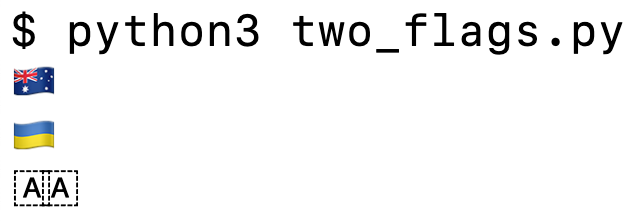
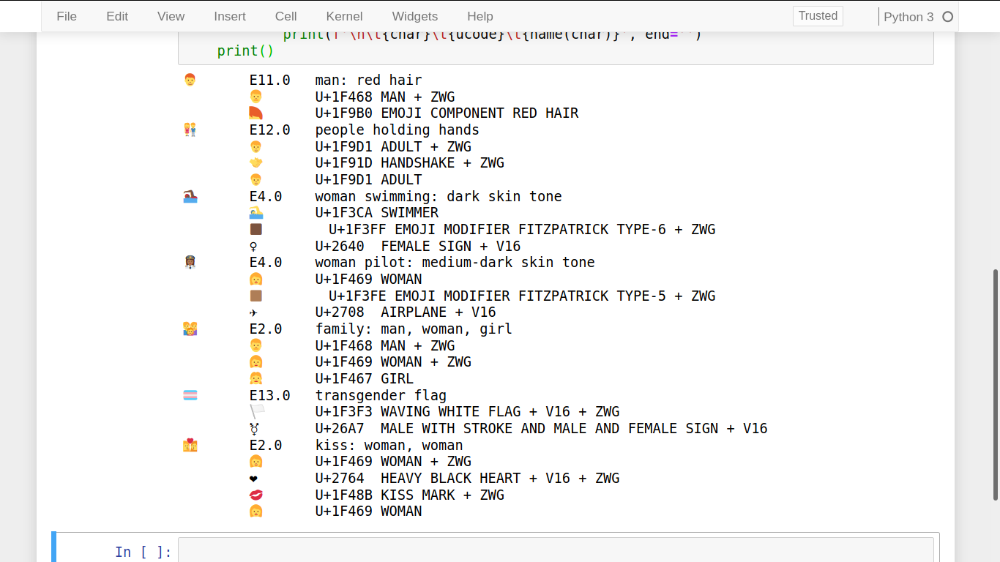

# 3. 다중 문자 이모지 만들기

유니코드는 문자와 발음 구별 기호<sup>diacritics</sup>를 결합해 문자를 악센트가 들어간 글자를 조합하는 것을 늘 지원해왔다. 이모지에 대한 늘어나는 수요를 충족시키기 위해 이 개념이 확장되었다.

_그림 1. 현대식 가족들_


이 글은 특수 기호와 문자를 조합해 새로운 상형문자를 만드는 방법을 설명한다.

내용:

[3.1 국기](./article3..md#31-국기)

[3.2 피부색](./article3..md#32-피부색)

[3.3 무지개 깃발과 ZWJ 조합](article3..md#33-무지개-깃발과-zwj-조합)

[3.4 최신 가족](./article3..md#34-최신-가족)

[3.5 읽을 거리](./article3..md#35-읽을-거리)

## 3.1 국기

역사적으로 국가들은 분리되거나, 합병되거나, 변경되거나, 그저 새로운 국기를 채택하곤 했다. 유니코드 콘소시엄에서는 이런 변화를 따라갈 필요 없이 유니코드를 지원하는 시스템에 이 문제를 떠넘기는 방법을 찾아냈다. 즉, 유니코드 문자 데이터베이스에 국기를 넣지 않았다. 대신 라틴 문자 A부터 Z에 해당하는 26개의 **지역 표시 기호**<sup>Regional Indicator Symbol</sup>(RIS)를 추가하고 `U+1F1E6`에서 `U+1F1FF`까지의 코드를 할당했다. 이 두 문자를 조합해 ISO 3166-1 국가코드를 만들면 해당 국가의 국기를 가져올 수 있다(물론 UI가 지원해야 한다). [예제 1]은 조합하는 방법을 보여준다.

_예제 1. two_flags.py: 지역 표시 문자를 조합해 국기 만들기_

```python
# 지역 표시 기호
RIS_A = '\U0001F1E6'  # 문자 A
RIS_U = '\U0001F1FA'  # 문자 U
print(RIS_A + RIS_U)  # AU: 호주
print(RIS_U + RIS_A)  # UA: 우크라이나
print(RIS_A + RIS_A)  # AA: 이런 국가 코드는 없다
```

[그림 2]는 macOS 10.14 터미널에서 [예제 1]을 실행한 결과다.

_그림 2. [예제 1]의 two\_flags.py를 실행한 화면. AA 조합은 점선 사각형 안 글자 A 두 개로 표시된다_



프로그램이 앱이 인식하지 못하는 표시 문자 조합을 출력하면 표시 문자가 점선 사각형 안의 글자로 출력된다. 이것 역시 UI에서 지원해야 이렇게 출력된다. [그림 2]의 마지막 줄을 참조하라.

>**NOTE_** 유럽과 UN은 하나의 국가는 아니지만 지역 표시자 EU와 UN으로 국기를 표현할 수 있다. 잉글랜드, 스코틀랜드, 웨일즈는 별도의 나라가 아니지만 유니코드에서 국기를 표시할 수 있다. 그러나 이런 국기들은 지역 표시 기호가 아니라 조금 더 복잡한 방법이 필요하다. 자세한 방법은 Emojipedia의 '이모지 깃발에 대한 설명'(https://blog.emojipedia.org/emoji-flags-explained/)를 참고하라.

이제 사람 얼굴, 손, 코 등을 보여주는 이모지에 피부색을 입히기 위해 사용할 수 있는 이모지 수정자 사용법을 알아보자.

## 3.2 피부색

유니코드는 다섯 가지 이모지 수정자를 제공해 흰색에서 짙은 갈색까지의 피부색을 설정할 수 있게 한다. 이 색깔은 인간 피부색에 자외선이 미치는 영향을 연구하기 위해 개발된 피츠패트릭 등급<sup>Fitzpatrick scale</sup>에 기반하고 있다. [예제 2]는 이 수정자들을 이용해 엄지척 이모지에 피부색을 설정하는 방법을 보여준다.

_예제 2. skin.py: 엄지척 및 여기에 사용 가능한 피부색을 모두 적용한 이모지들_

```python
from unicodedata import name

SKIN1 = 0x1F3FB   # EMOJI MODIFIER FITZPATRICK TYPE-1-2 # (1)
SKINS = [chr(i) for i in range(SKIN1, SKIN1 + 5)]       # (2)
THUMB = '\U0001F44d'  # THUMBS UP SIGN 👍

examples = [THUMB]                                      # (3)
examples.extend(THUMB + skin for skin in SKINS)         # (4)

for example in examples:
    print(example, end='\t')                            # (5)
    print(' + '.join(name(char) for char in example))   # (6)
```
(1) 첫 번째 수정자는 `EMOJI MODIFIER FITZPATRICK TYPE-1-2`다.
(2) 사용 가능한 수정자 다섯 개의 리스트를 만든다.
(3) 수정하지 않은 `THUMBS UP SIGN` 문자로부터 시작한다.
(4) 동일한 이모지에 각 수정자를 적용한 문자들의 리스트를 만든다.
(5) 이모지와 탭을 출력한다.
(6) 문자명 및 `'+'` 뒤에 결합된 수정자의 이름을 출력한다.

macOS에서 [예제 2]를 실행한 모습은 [그림 3]과 같다. 그림에서 볼 수 있듯이 수정하지 않은 이모지는 만화스러운 노란색이지만, 나머지는 실제 피부색에 가깝게 나타난다.

_그림 3. macOS 10.14 터미널에서 [예제 2]를 실행한 화면_


이제 특수 기호를 이용해 이모지를 조금 더 복잡하게 조합하는 방법을 알아보자.

## 3.3 무지개 깃발과 ZWJ 조합

지금까지 본 특수 목적의 지시나와 수정자 외에도 유니코드는 이모지와 다른 글자를 붙이기 위해 사용되는 보이지 않는 표시로 폭 없는 접합자<sup>Zero Width Joiner</sup>(`U+200D`, `ZERO WIDTH JOINER`)를 제공한다. 여러 유니코드 문서에서는 이 문자를 간단히 ZWJ로 부른다.

예를 들어 [그림 4]에서 보는 것처럼 무지개 깃발은 `WAVING WHITE FLAG`과 `RAINBOW`를 연결해 만들 수 있다.

_그림 4. 파이썬 콘솔에서 무지개 깃발 만들기_


유니코드 13은 1,100개가 넘는 ZWJ 이모지 시퀀스를 지원하는데, 이를 간단히 범용 교환 권고안<sup>recommended for general interchange</sup>(RGI)이라고 한다.

>여러 플랫폼에서 폭넓게 지원해 [...중략...] 범용 교환에 사용하도록 권장한다.[^1]

유니코드 13의 모든 RGI ZWJ 이모지 시퀀스는 emoji-zwj-sequences.txt(https://unicode.org/Public/emoji/13.0/emoji-zwj-sequences.txt)에서 볼 수 있는데, 그중 일부는 [그림 5]와 같다.

_그림 5. [예제 3]으로 생성한 몇 가지 ZWJ 시퀀스. 우분투 19.10에서 실행되는 파이어폭스 72에서 주피터 노트북을 실행한 화면. 이 OS와 브라우저 조합을 이용하면 이모지 12.0과 이모지 13.0에 추가된 `people holding hands`와 `transgender flag` 등 최신 이모지들을 모두 볼 수 있다.



[그림 5]를 생성한 소스 코드는 다음 [예제 3]과 같다. 터미널에서도 실행할 수 있지만, 브라우저에서 실행되는 주피터 노트북에 복사해 붙여넣어 실행 결과를 확인하는 것을 권장한다. 일반적으로 브라우저가 유니코드를 가장 빨리 지원하고, 이모지 상형문자도 더 이쁘기 때문이다.

_예제 3. zwj.sample.py: 일부 ZWJ 문자들을 생성_

```python
from unicodedata import name

zwg_sample = """
1F468 200D 1F9B0            |man: red hair                      |E11.0
1F9D1 200D 1F91D 200D 1F9D1 |people holding hands               |E12.0
1F3CA 1F3FF 200D 2640 FE0F  |woman swimming: dark skin tone     |E4.0
1F469 1F3FE 200D 2708 FE0F  |woman pilot: medium-dark skin tone |E4.0
1F468 200D 1F469 200D 1F467 |family: man, woman, girl           |E2.0
1F3F3 FE0F 200D 26A7 FE0F   |transgender flag                   |E13.0
1F469 200D 2764 FE0F 200D 1F48B 200D 1F469 |kiss: woman, woman  |E2.0
"""

markers = {'\u200D': 'ZWG',  # ZERO WIDTH JOINER
           '\uFE0F': 'V16',  # VARIATION SELECTOR-16
           }

for line in zwg_sample.strip().split('\n'):
    code, descr, version = (s.strip() for s in line.split('|'))
    chars = [chr(int(c, 16)) for c in code.split()]
    print(''.join(chars), version, descr, sep='\t', end='')
    for char in chars:
        if char in markers:
            print(' + ' + markers[char], end='')
        else:
            ucode = f'U+{ord(char):04X}'
            print(f'\n\t{char}\t{ucode}\t{name(char)}', end='')
    print()
```

최신 유니코드는 `SWIMMER`(`U+1F3CA`)나 `ADULT`(`U+1F9D1`) 등 중성적인 이모지를 추가하는 성향이 있다. 이 문자들은 그대로 출력할 수도 있고, 여성 기호(`♀`, `U+2640`)나 남성 기호(`♂`, `U+2642`)와 함께 ZWJ 시퀀스를 이용해 성별을 나타낼 수도 있다.

## 3.4 최신 가족

유니코드 콘소시엄은 또한 가족 이모지를 지원하는 데 있어서도 다양성을 지원하고 있다. [그림 6]은 2020년 1월 1현 부모와 자식의 다양한 조합을 지원하는 가족 이모지를 보여주고 있다.

_그림 6. 위쪽에는 편부모와 커플을, 왼쪽에는 소년과 소녀들을, 표 안쪽에는 부모와 자식의 조합으로 이루어진 가족 이모지를 보여준다. 브라우저에서 이모지를 지원하지 않더라도 표 안에 이모지 몇 개는 보일 것이다. 윈도 10에서 파이어폭스 72를 실행하면 모든 조합을 볼 수 있다._


[그림 6]을 만드는 코드는 Bottle 프레임워크(https://bottlepy.org/docs/dev/)를 사용했는데 가족 이모지를 표 형태로 담은 HTML을 생성한다. 이 사이트의 공개 리포지토리에서 emoji_families.py 파일을 볼 수 있다.

이 페이지를 보려면, Bottle 프레임워크(https://pypi.org/project/bottle/)를 설치하고, emoji_families.py 스크립트를 실행한 후 http://localhost:8080/에 접속하면 된다.

>**TIP_** 웹브라우저들은 유니코드 이모지를 빠르게 따라가는데, OS는 약간 뒤쳐지는 경향이 있다. 이번 글을 준비하면서 [그림 5]는 우분투 19.10에서, [그림 6]은 윈도 10에서, 둘 다 파이어폭스 72 브라우저를 이용해 캡처했다. 이 OS/웹브라우저 조합을 이용해야 원하는 이모지 조합을 모두 볼 수 있었기 때문이다.

## 3.5 읽을 거리

유니코드 이모지 표준에 대해 더 알고 싶다면 '유니코드 인덱스 페이지'(https://unicode.org/emoji/techindex.html)를 살펴보길 바란다. 이 페이지는 '유니코드 기술 표준 #51: 유니코드 이모지'(https://unicode.org/reports/tr51/index.html)와 '이모지 데이터 파일'(https://unicode.org/Public/emoji/12.1/emoji-zwj-sequences.txt)을 볼 수 있다. [그림 5]를 생성하기 위해 이모지 데이터 파일 페이지에서 제공하는 예제 코드를 사용했다.

Emojipedia(https://emojipedia.org/)는 이모지를 찾고 이모지에 대해 배우는 데 가장 좋은 웹사이트다. 검색할 수 있는 데이터베이스 외에도, Emojipedia는 '이모지 ZWJ 시퀀스: 세 글자, 많은 가능성'(https://blog.emojipedia.org/emoji-zwj-sequences-three-letters-many-possibilities/)와 '이모지 깃발에 대한 설명'(https://blog.emojipedia.org/emoji-flags-explained/) 등 좋은 글을 담은 블로그도 제공한다.

2016년 뉴욕시에 있는 현대 미술 박물관(Museum of Modern Art, MoMA)은 일본 이동통신사 NTT 도코모에서 1999년 시게타카 쿠리타가 만든 이모지 176개(https://stories.moma.org/the-original-emoji-set-has-been-added-to-the-museum-of-modern-arts-collection-c6060e141f61)를 콜렉션에 추가했다.

역사를 더 거슬러 올라가서 Emojipedia는 '최초의 이모지에 대한 기록 정정'(https://blog.emojipedia.org/correcting-the-record-on-the-first-emoji-set/)을 통해 1997년 휴대폰에 이모지를 배포한 일본의 소프트뱅크를 최초의 이모지 개발자로 인정했다. 소프트뱅크의 이모지는 `U+1F4A9` (`PILE OF POO`) 등 유니코드에서 이모지 90개의 원천이다.

2010년부터 2019년에 일어난 이모지의 진화의 문화와 정치에 대해서는 기즈모도에 올라온 패디 존슨의 기사 '빼앗긴 이모지'(https://gizmodo.com/emoji-we-lost-1841017375)에서 집중적으로 다룬다.

매튜 로텐버그<sup>Matthew Rothenberg</sup>의 https://emojitracker.com/ 은 X에서 사용되고 있는 이모지의 양을 실시간으로 대시보드 형태로 보여준다. 2021년은 물론 2024년 현재까지 `FACE WITH TEARS OF JOY` (`U+1F602`)가 가장 인기 있는 이모지를 유지하고 있다.

## 뒷 이야기

### 축구의 위력

잉글랜드, 스코틀랜드, 웨일즈는 자신들의 이모지가 있지만, 텍사스나 다른 국가의 지역은 깃발이 없는 이유는 무엇일까? 앞의 세 지역은 축구의 규칙을 통제하는 국제 축구 연맹의 영구 회원이기 때문이다. 이 지역들은 FIFA 월드컵에 자신의 '국가팀'을 출전시킬 수 있다. 따라서 이들의 경기 대전표를 보여주기 위해 방송사에서 이들의 국기가 필요해졌기 때문이다. 사실 이것은 필자의 근거 없는 가설일 뿐이다.

[^1]: 유니코드 기술 표준 #51 - 유니코드 이모지(https://www.unicode.org/reports/tr51/)에서 발췌